# Example screenshots

PNG screenshots of every layout in [`../examples`](../examples), one per file.

Each image is the real rendered frame: captured with `FORCE_COLOR=3` so Ink
emits ANSI colors, then rasterized to PNG (Menlo, 80×24 cell grid, dark theme).
Regenerate with the steps in the [examples README](../examples/README.md).

## Interactive index

`npm run examples` opens this picker (sidebar + master-detail + status bar):

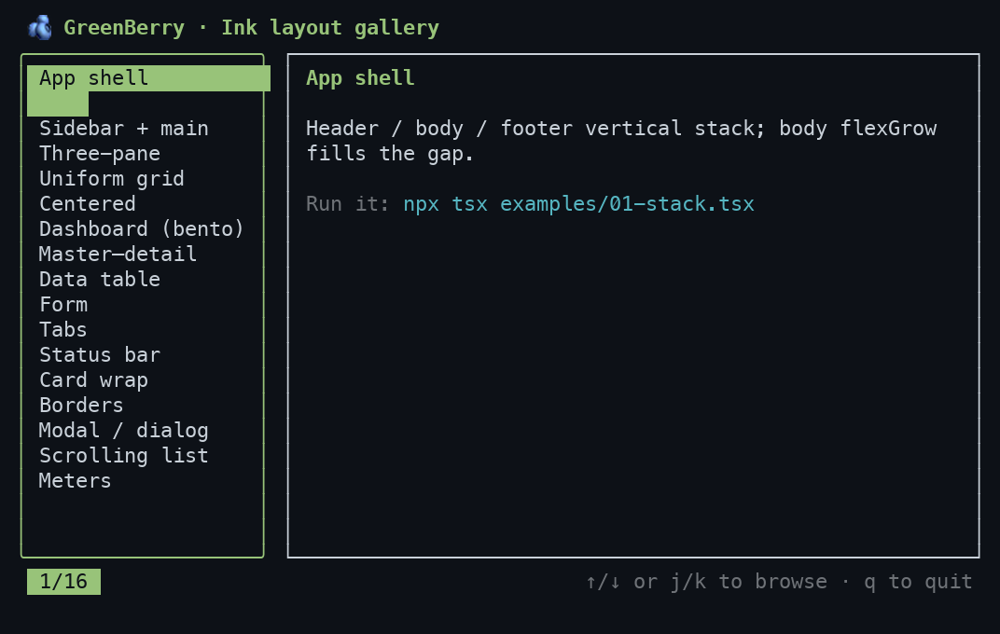

## Layouts

### 01 · App shell — header / body / footer

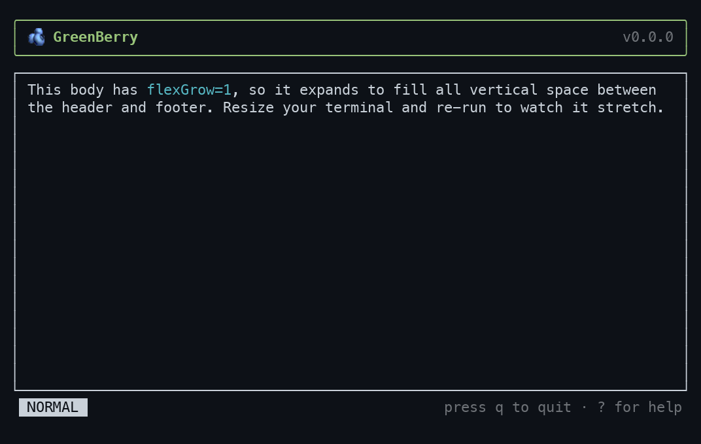

### 02 · Sidebar + main

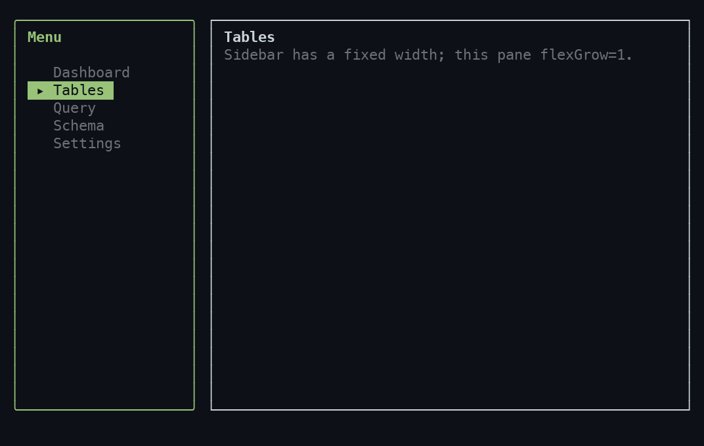

### 03 · Three-pane (nav / main / inspector)

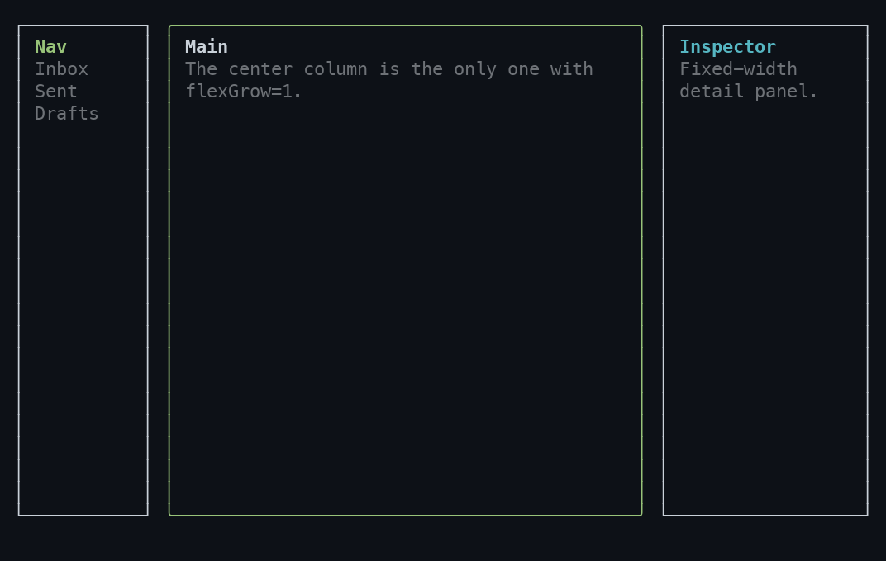

### 04 · Uniform grid

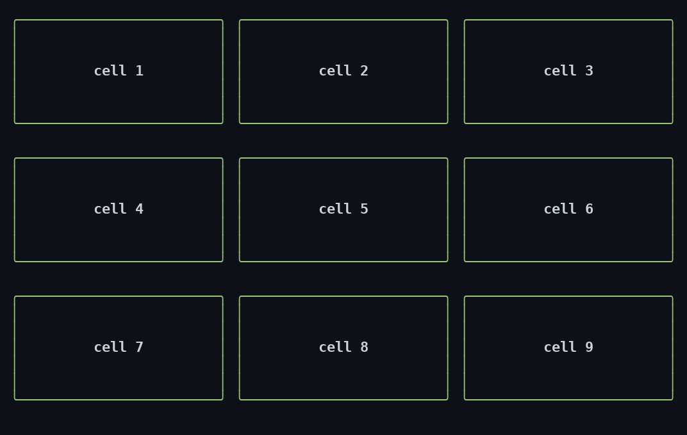

### 05 · Centered (splash / empty state)

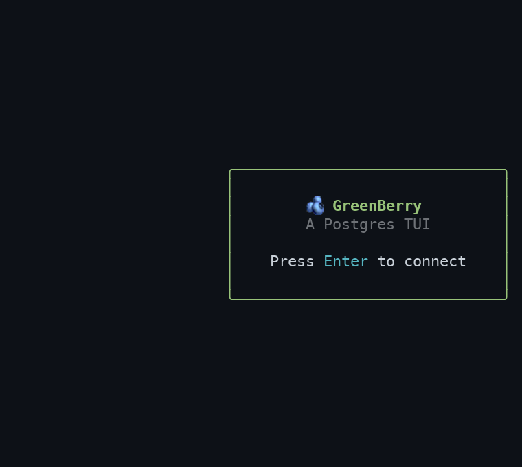

### 06 · Dashboard (bento)

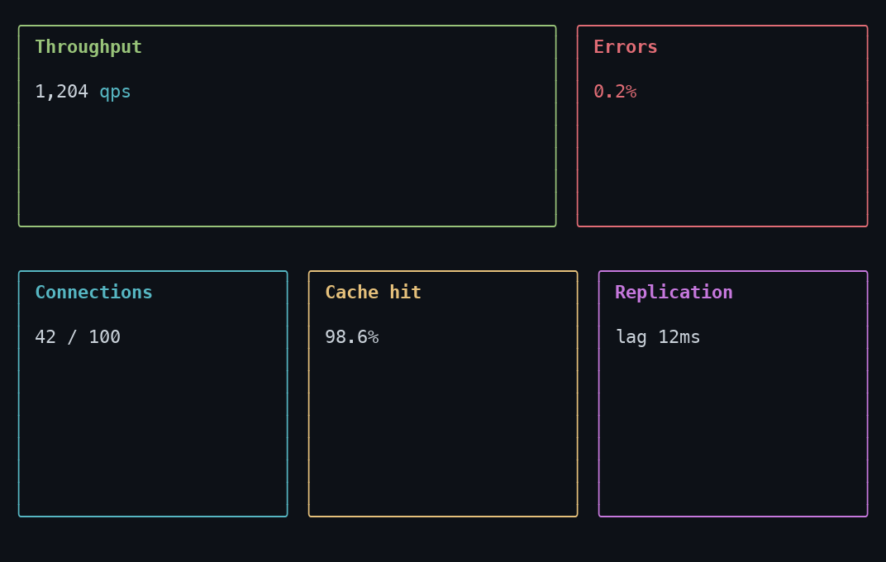

### 07 · Master–detail

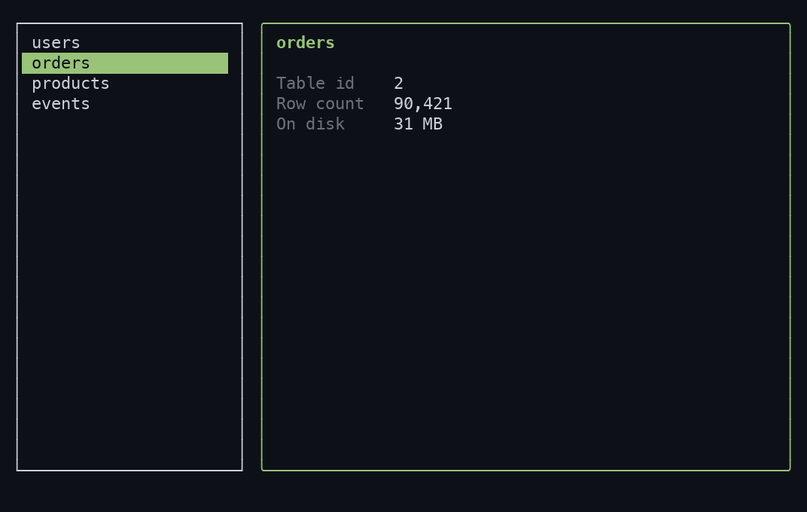

### 08 · Data table

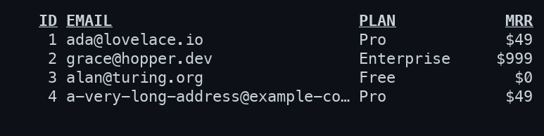

### 09 · Form

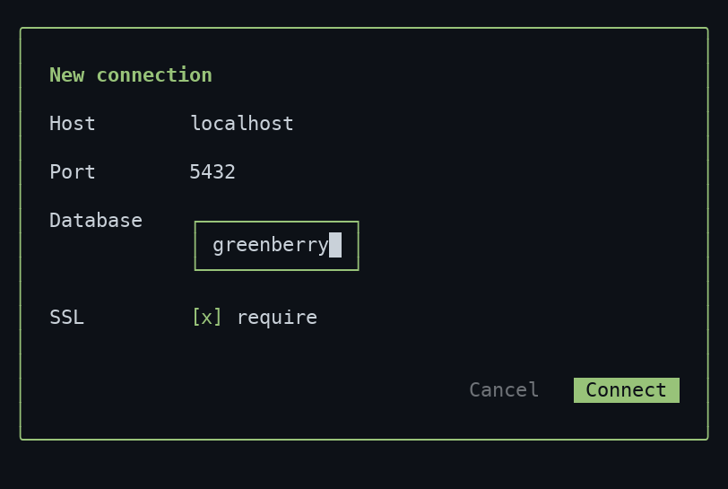

### 10 · Tabs

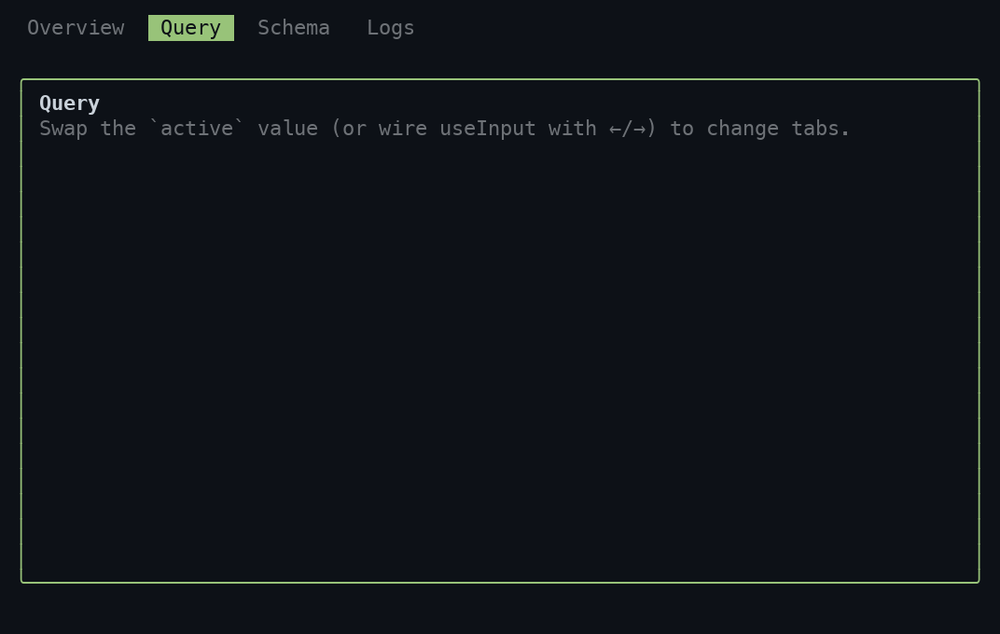

### 11 · Status bar

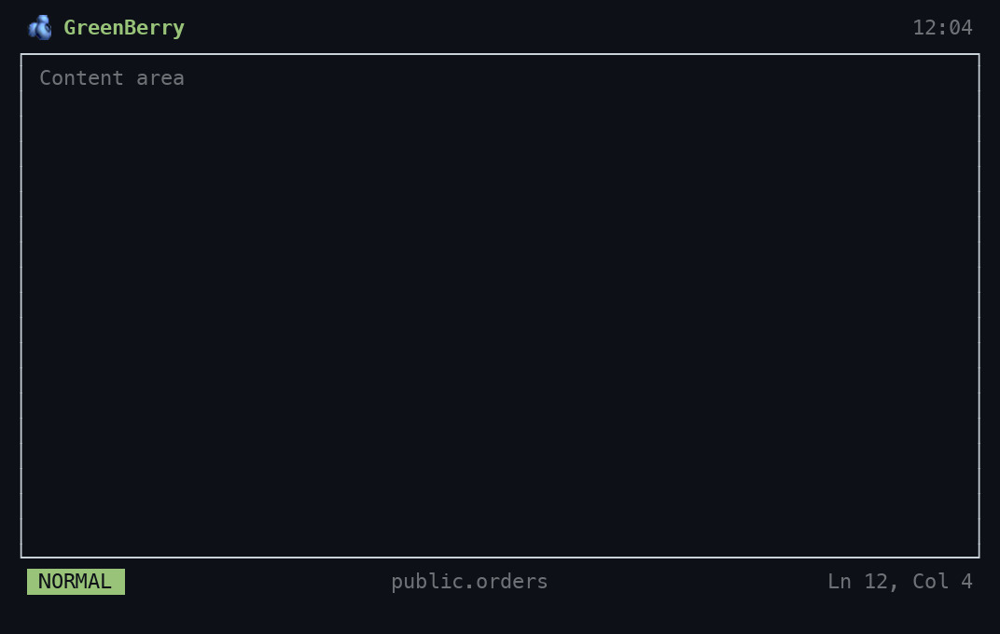

### 12 · Card wrap

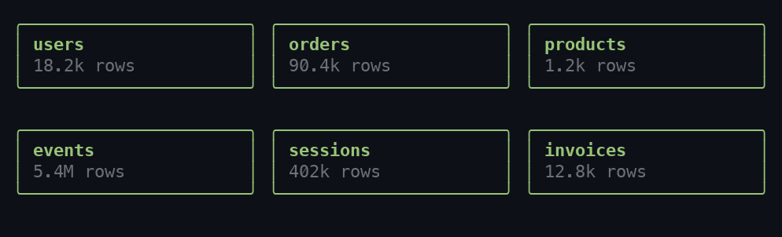

### 13 · Borders

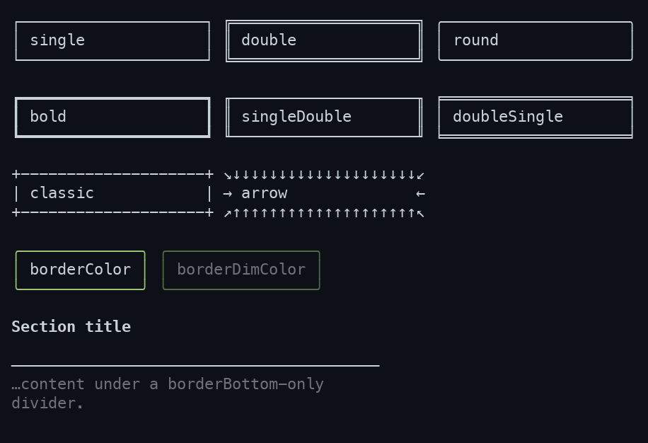

### 14 · Modal / dialog

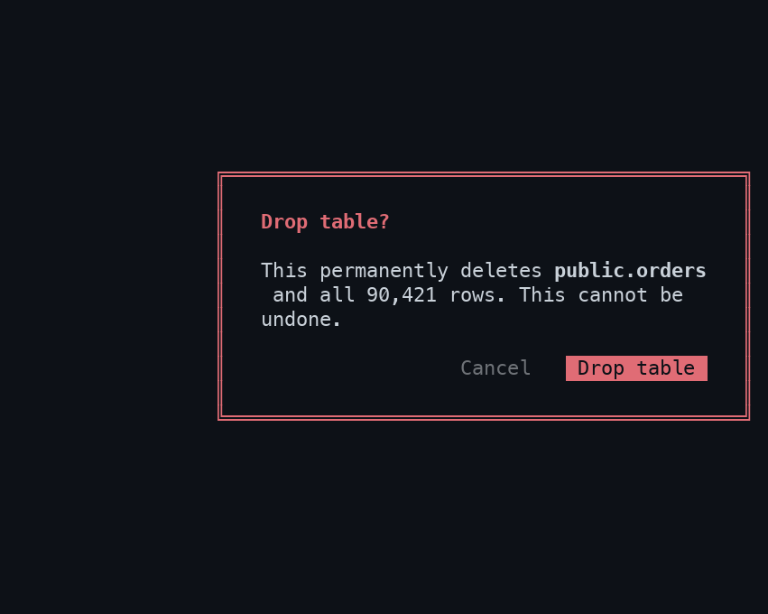

### 15 · Scrolling list

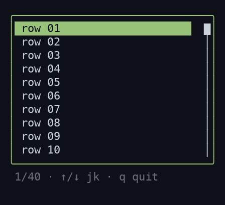

### 16 · Meters / progress bars

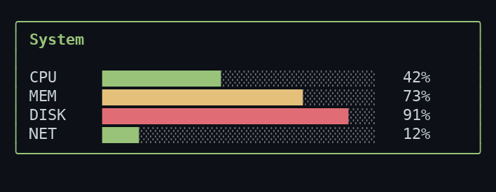
