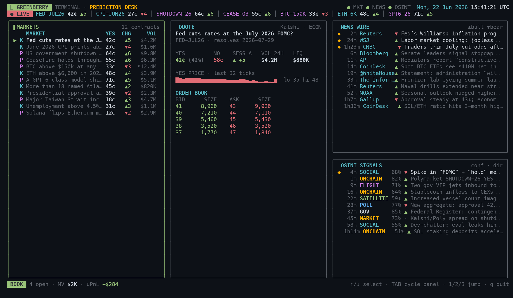

# GreenBerry Terminal

A Bloomberg-style **terminal UI for prediction-market traders** — live markets,
a news wire, and OSINT signals in one dense screen, to help you monitor and
price bets on **Kalshi** and **Polymarket**.

Built with [Ink](https://github.com/vadimdemedes/ink) (React for the terminal) +
TypeScript.



> **Data is simulated.** The UI ships with realistic mock feeds and a built-in
> price-tick simulator so the whole thing feels live out of the box. Wiring real
> data is a matter of replacing the adapters in `src/data/*` — see
> [Wiring real data](#wiring-real-data).

## Run it

Dependencies are already installed. From this folder:

```bash
npm start        # run the terminal (press q to quit)
```

Other scripts:

```bash
npm run dev      # live-reload while editing (tsx watch); Ctrl+C to stop the watcher
npm run build    # compile to dist/ (tsc)
npm run typecheck
```

Best viewed at **140×40 or larger** — it's a three-column dashboard.

## Keys

| Key            | Action                          |
| -------------- | ------------------------------- |
| `↑`/`↓` or `j`/`k` | move the market selection   |
| `g` / `G`      | jump to top / bottom            |
| `Tab`          | cycle which panel is focused    |
| `1` / `2` / `3`| jump focus to Markets / News / OSINT |
| `q` or `Esc`   | quit                            |

Selecting a market drives the whole screen: the **Quote** panel, and the
relevance markers (`◆`) + sorting in **News** and **OSINT** all follow it.

## Layout

```
┌ Header ─ brand · MKT/NEWS/OSINT status · UTC clock ───────────────────────────┐
├ Ticker ─ live scrolling marquee of the book ──────────────────────────────────┤
│ ┌ Markets ───────┐ ┌ Quote ───────────────────┐ ┌ News Wire ────────────────┐ │
│ │ watchlist table│ │ YES/NO · session Δ        │ │ headlines, source,        │ │
│ │ (master list)  │ │ sparkline · order book    │ │ sentiment, relevance      │ │
│ │                │ │                           │ ├ OSINT Signals ────────────┤ │
│ │                │ │                           │ │ kind · confidence · dir   │ │
│ └────────────────┘ └───────────────────────────┘ └───────────────────────────┘ │
├ Status ─ open positions · mark value · unrealized P&L · key hints ─────────────┤
```

Layout patterns in play: app-shell stack, fixed sidebar + flexible center +
fixed right column, master–detail, aligned tables, sparklines, a scrolling
ticker, and a P&L status bar.

## Project structure

```
src/
  cli.tsx              entry (meow + render)
  app.tsx              top-level layout, state, live ticks, keybindings
  theme.ts             colors (up/down, venues, sentiment, impact)
  util.ts              formatters + sparkline/bar/seeded-history helpers
  hooks/
    useInterval.ts     declarative setInterval
    useNow.ts          1s clock
  components/
    Header, Ticker, Watchlist, MarketDetail,
    NewsPanel, OsintPanel, StatusBar, Panel, Sparkline
  data/
    types.ts           Market / NewsItem / OsintSignal / Position
    markets.ts         sample Kalshi + Polymarket book   ← replace
    news.ts            sample news wire                  ← replace
    osint.ts           sample OSINT signals              ← replace
    positions.ts       sample positions + P&L math
    feed.ts            tick simulator + synthetic order book ← replace
```

## Wiring real data

Everything renders off the types in `src/data/types.ts`. To go live, keep those
shapes and swap the source modules:

- **Markets** (`data/markets.ts`) — pull contracts from:
  - Kalshi REST/WebSocket: `https://trading-api.readme.io`
  - Polymarket Gamma / CLOB API: `https://docs.polymarket.com`
  Map each contract into a `Market` (`yes` is the 0–100 YES price).
- **Live updates** (`data/feed.ts`) — replace `tickMarkets` with a WebSocket
  handler that merges venue price updates into the `Market[]`. Replace
  `buildBook` with the real order book where available.
- **News** (`data/news.ts`) — fan in wires/RSS/social; tag each item with the
  market ids and/or categories it moves so the panels can prioritize them.
- **OSINT** (`data/osint.ts`) — collectors for on-chain flow, social trend
  spikes, flight/vessel tracking, polls, filings, etc. Emit `OsintSignal`s with
  a `confidence` and a directional `delta`.
- **Positions** (`data/positions.ts`) — read from your venue accounts; the P&L
  math is already there.

No component changes are required — the UI is decoupled from the data source.

## Notes

- Rendering is responsive to terminal size; the center column flexes while the
  side columns stay fixed.
- `npm run dev` uses `tsx watch`, a persistent file watcher — `q` unmounts the
  app but the watcher keeps running, so use `npm start` when you want `q` to drop
  you back to the shell.
